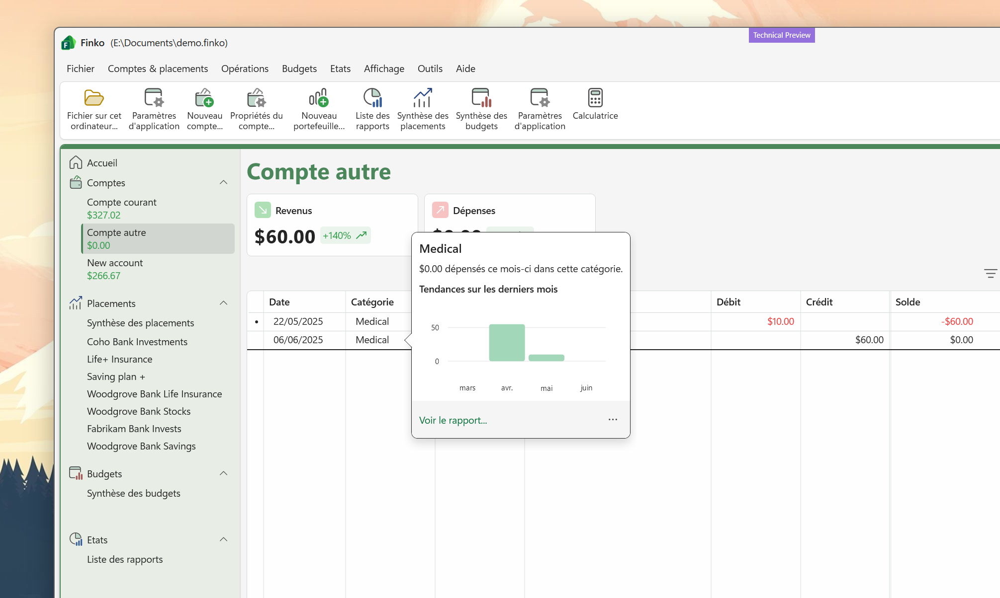

# Account view

## Widgets

Widgets are shown at the top the this view. They give you information about expenses, incomes of the current month and compare the values with the previous month.  

### Customize widgets
<!-- md:version v="2025.9.14.0" -->

To hide the widgets bar:
* Right click the widgets area
* Select **Hide widgets bar**

## Transactions list

### Quick information

<!-- md:version v="2025.9.14.0" -->

When you **click** on a category in the transactions list, a small popup opens and gives you insights on the current category, event if you don't set a budget on it.
