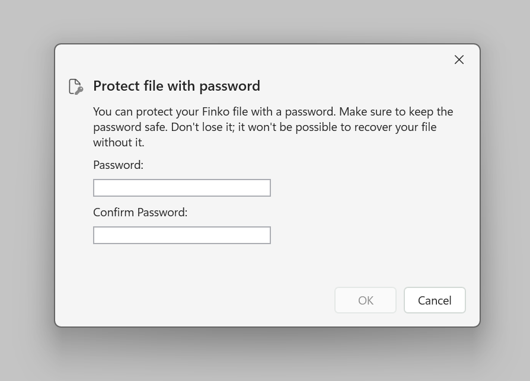
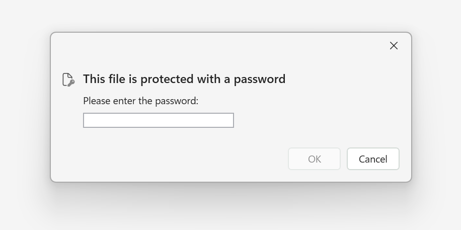

# Protecting Finko files

!!! note ""

    This feature has been added to Finko in 2025.6.21.0 release.

We know that the data you handle with Finko is sensitive.  
That's why Finko lets you encrypt files.

## Security information

We use [SQLCipher](https://www.zetetic.net/sqlcipher/).  

This security method uses AES-256 symmetric encryption and password derived via PBKDF2.

## Protect a file

To protect an existing Finko file, you first have to open the file normally.  
Once the file is loaded in the application:  
* Open the **file** menu
* Select **Protect file...**  
* The **dialog** opens

In the dialog:  
* Enter the password you want to use
* Re-renter the password to confirm
* Click **Ok**
* Wait for the process to complete

Finko will create a copy of your original file. It has the same name with "_protected" at the end.  
This is to make sure you can still open the unprotected fil in case of problem when securing with the password.  
Once you have checked that everything works correctly with no data loss, you can delete your old unprotected file and work only with the new one.

!!! warning ""

    Be sure not to forget your password.   
    It is not possible to recover a file without the correct password.

## Open a protected file

When you open a Finko file that is protected, this dialog opens:

In the dialog:
* Enter the password that was used for the file
* Click **Ok**

!!! warning ""

    You will be prompted until the password is correct.  
    If you don't remember the password or want to abort file loading, just click **Cancel**.
